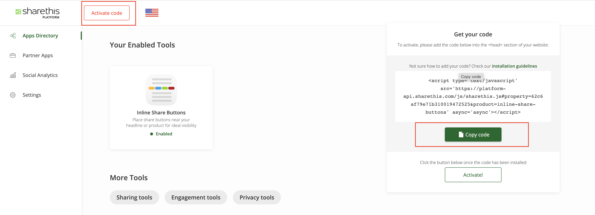
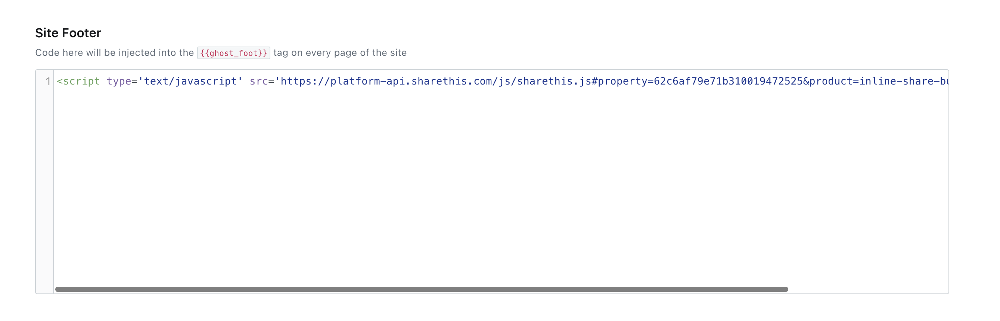
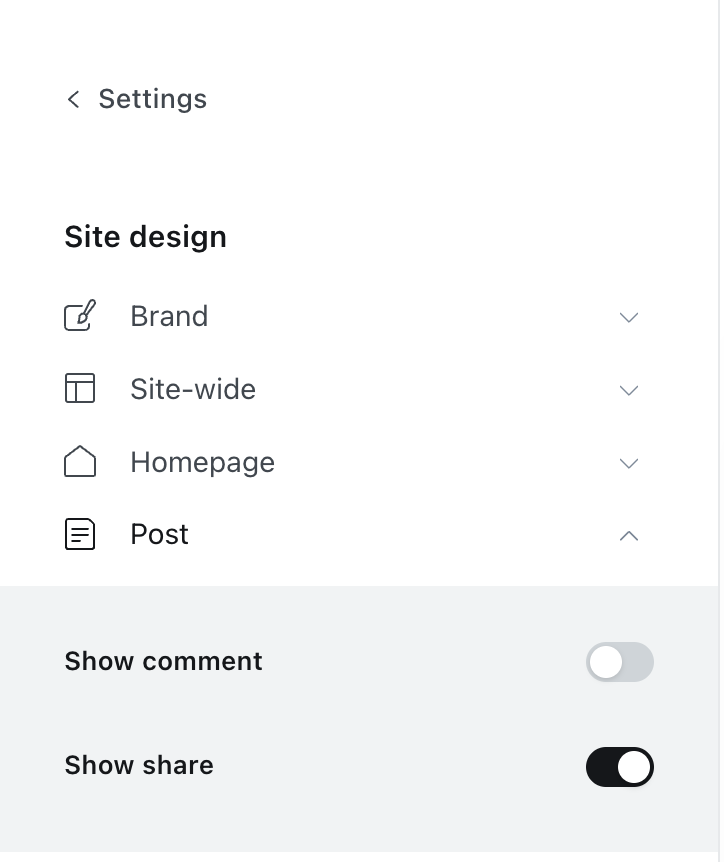

# Sharethis button installation

- You need to have an account at [Sharethis](https://sharethis.com/)
- After that, you just click at `Active code` then click `Copy code` like image below

- Go to `Ghost Admin > Settings > Code Injection` then paste to `Site footer`

- Finally, you go to `Ghost Admin > Settings > Design`. Collapse the `Post` tab then enable `Show share` settings

